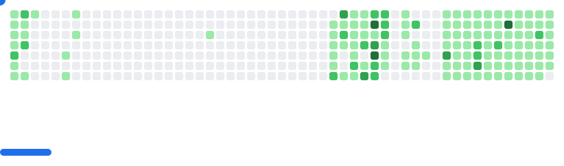

<!-- GitHub Profile README for nam-techie -->
<div align="center">
  
</div>

<h1 align="center">
  
</h1>

<h3 align="center">💻 Fullstack Developer | React • Spring Boot • Java • TypeScript 🚀</h3>

<div align="center">
  
</div>

<p align="center">
  
</p>

<div align="center">
  
  
  
</div>

---

## 🌟 About Me


- 🧠 I'm passionate about building real-world web applications that solve user-centric problems
- 🎓 I love working with **React**, **TypeScript**, **Spring Boot**, and **Java** to create robust solutions
- 🧪 I apply **TDD**, **CI/CD**, and **clean architecture** across my projects
- 🌱 Currently learning **Microservices** and **Cloud Architecture**
- 💬 Ask me about **React, Java, Spring Boot, TypeScript**
- ⚡ Fun fact: I love solving complex problems with elegant code solutions

<br clear="both"/>

---

## 👨‍💻 A little more about me...

```javascript
const nam = {
    pronouns: "he" | "him",
    code: ["Java", "Python", "TypeScript", "JavaScript", "HTML", "CSS"],
    tools: ["Spring Boot", "PostgreSQL", "MySQL", "SQL Server", "MongoDB", "JWT", "React", "Tailwind", "Jest"],
    architecture: ["RESTful API", "microservices", "event-driven", "design system pattern"],
    techCommunities: {
        contributor: "Open Source",
        learner: "100DaysOfCode",
        mentor: null
    },
    challenge: "I am doing the #100DaysOfCode challenge focused on backend with Java and Spring Boot"
}
```

---

## 🚀 Featured Projects

<div align="center">
  <table>
    <tr>
    game

<picture>
  <source
    media="(prefers-color-scheme: dark)"
    srcset="images/breakout-dark.svg"
  />
  <source
    media="(prefers-color-scheme: light)"
    srcset="images/breakout-light.svg"
  />
  
</picture>

<div align="center">
  
</div>
